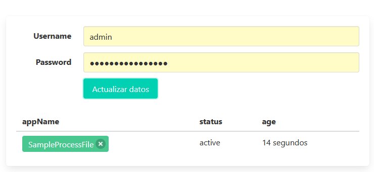

# simgr

SIMgr es un gestor de aplicaciones desplegadas para WSO2 Streaming Integrator Server. Ofrece una interfaz muy básica sobre la [API REST de WSO2SI](https://docs.wso2.com/display/SP440/Siddhi+Application+Management+APIs), listando las aplicaciones instaladas en un servidor, y permitiendo eliminarlas.

## Interfaz Web UI



## Ejecución de simgr

```bash
$ ./simgr -help
Usage of ./simgr:
  -port int
        HTTP Listen Port Number (default 8080)
  -quiet
        Disable regular logging
  -url string
        URL to proxy API requests to
```

## Acceso a la aplicación

http://localhost:8080/simgr/
